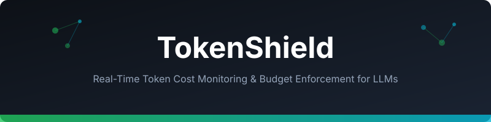

<div align="center">



# 🛡️ TokenShield

**Real-time token cost monitoring, budget enforcement, and optimization for LLM applications.**

[](https://python.org)
[](LICENSE)
[]()
[]()

*Stop burning money on LLM API calls. TokenShield gives you per-request cost tracking, budget gates, and automatic optimization — before the invoice arrives.*

</div>

---

## The Problem

```
Month 1:  $50    "This is cheap!"
Month 2:  $200   "Growth is normal"
Month 3:  $3,400 "WHAT HAPPENED?!"
```

LLM costs are invisible until the bill arrives. A single misconfigured loop, a verbose system prompt, or an unbound tool list can 10x your spend overnight.

## The Solution

```python
from tokenshield import Shield, BudgetPolicy

shield = Shield(
    model="gpt-4o",
    policy=BudgetPolicy(
        max_cost_per_request=0.05,     # $0.05 per request
        max_cost_per_hour=2.00,        # $2/hour
        max_cost_per_day=20.00,        # $20/day
        alert_threshold_pct=80,        # Alert at 80% of any limit
    )
)

# Wrap any LLM call
result = shield.call(
    messages=[{"role": "user", "content": "Summarize this order"}],
    tools=tool_schemas,
)

print(shield.report())
# ┌─────────────────────────────────┐
# │ Requests today:     142         │
# │ Tokens (in/out):    89K / 12K   │
# │ Cost today:         $4.23       │
# │ Budget remaining:   $15.77      │
# │ Avg cost/request:   $0.030      │
# │ Most expensive:     search (48%)│
# └─────────────────────────────────┘
```

## Features

| Feature | Description |
|---------|-------------|
| **Cost Tracking** | Per-request, per-hour, per-day cost accumulation with model-aware pricing |
| **Budget Gates** | Hard limits that reject calls before they execute (no surprise bills) |
| **Alert Hooks** | Webhook/callback when approaching budget thresholds |
| **Token Estimation** | Pre-flight token count estimation before calling the API |
| **Model Pricing DB** | Built-in pricing for GPT-4o, Claude, Gemini, Mistral, and custom models |
| **Optimization Tips** | Automatic suggestions: "Your system prompt is 4,200 tokens — consider trimming" |
| **Dashboard Export** | JSON/CSV export for cost dashboards and observability tools |
| **Async Support** | Full async/await support for high-throughput applications |

## Architecture

```
┌──────────────────────────────────────────────────────────┐
│                     Your Application                      │
├──────────────────────────────────────────────────────────┤
│                                                          │
│  ┌──────────┐   ┌──────────┐   ┌──────────────────────┐ │
│  │ shield   │──→│ estimator│──→│ budget_gate          │ │
│  │ .call()  │   │ (tokens) │   │ (allow / reject)     │ │
│  └──────────┘   └──────────┘   └──────────┬───────────┘ │
│       │                                     │            │
│       │         ┌──────────┐   ┌───────────▼──────────┐ │
│       │         │ tracker  │←──│ LLM API call         │ │
│       │         │ (costs)  │   │ (litellm / openai)   │ │
│       │         └────┬─────┘   └──────────────────────┘ │
│       │              │                                   │
│  ┌────▼──────────────▼─────┐   ┌──────────────────────┐ │
│  │ reporter                │   │ alert_hooks          │ │
│  │ (dashboard / export)    │   │ (webhook / callback) │ │
│  └─────────────────────────┘   └──────────────────────┘ │
│                                                          │
└──────────────────────────────────────────────────────────┘
```

## Quick Start

```bash
pip install tokenshield
```

### Basic Usage

```python
from tokenshield import Shield

shield = Shield(model="gpt-4o")

# Track a call (wrap your existing LLM call)
result = shield.call(messages=[...])

# Check current spend
print(f"Today: ${shield.tracker.cost_today:.2f}")
```

### Budget Enforcement

```python
from tokenshield import Shield, BudgetPolicy

shield = Shield(
    model="gpt-4o",
    policy=BudgetPolicy(max_cost_per_request=0.10)
)

try:
    result = shield.call(messages=huge_prompt)
except shield.BudgetExceeded as e:
    print(f"Blocked! Estimated cost ${e.estimated_cost:.3f} exceeds limit")
```

### Alert Hooks

```python
shield = Shield(
    model="gpt-4o",
    policy=BudgetPolicy(max_cost_per_day=20.00, alert_threshold_pct=80),
    on_alert=lambda msg: slack.post(channel="#llm-costs", text=msg),
)
```

### Optimization Suggestions

```python
tips = shield.optimize(messages, tools)
# [
#   "System prompt is 3,800 tokens (63% of input). Consider compressing.",
#   "18 tools bound but only 3 used. Use dynamic tool binding to save ~2,250 tokens.",
#   "History has 45 messages. Consider windowing to last 20.",
# ]
```

## Pricing Database

Built-in pricing (updated monthly):

| Model | Input ($/1M) | Output ($/1M) | Context |
|-------|-------------|---------------|---------|
| gpt-4o | $2.50 | $10.00 | 128K |
| gpt-4o-mini | $0.15 | $0.60 | 128K |
| claude-3.5-sonnet | $3.00 | $15.00 | 200K |
| claude-3-haiku | $0.25 | $1.25 | 200K |
| gemini-1.5-pro | $1.25 | $5.00 | 1M |
| mistral-large | $2.00 | $6.00 | 128K |

Add custom models:

```python
shield.pricing.add("my-finetuned-model", input=5.00, output=15.00)
```

## Documentation

- [Architecture & Data Flow](docs/architecture.md) — Mermaid diagrams of the full pipeline
- [Benchmarks](docs/benchmarks.md) — Cost savings measurements across real workloads
- [API Reference](docs/api.md) — Full class/method documentation

## License

MIT — see [LICENSE](LICENSE)
