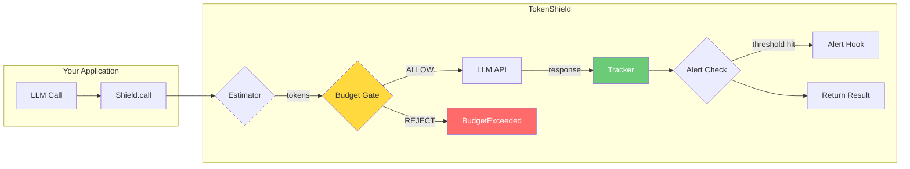
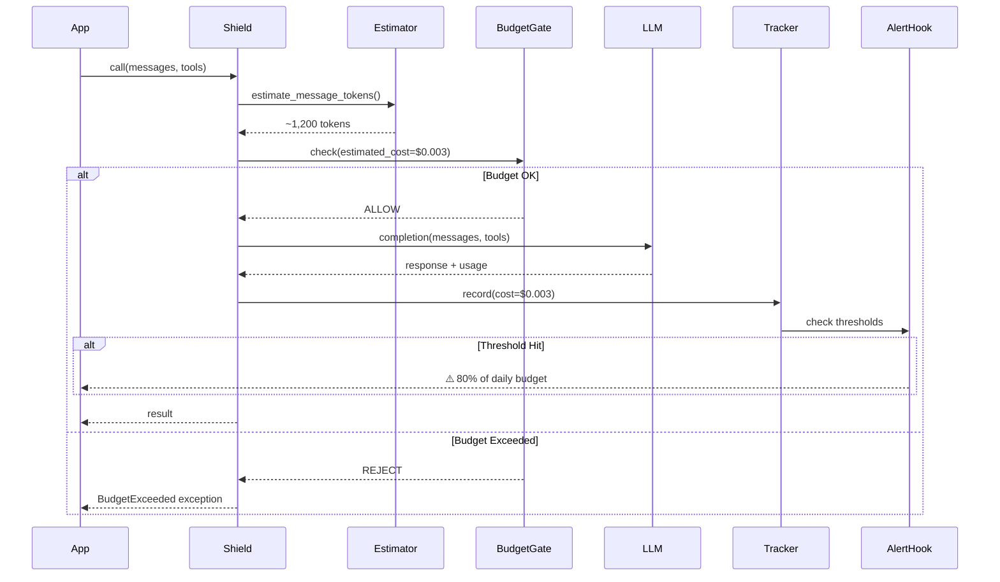
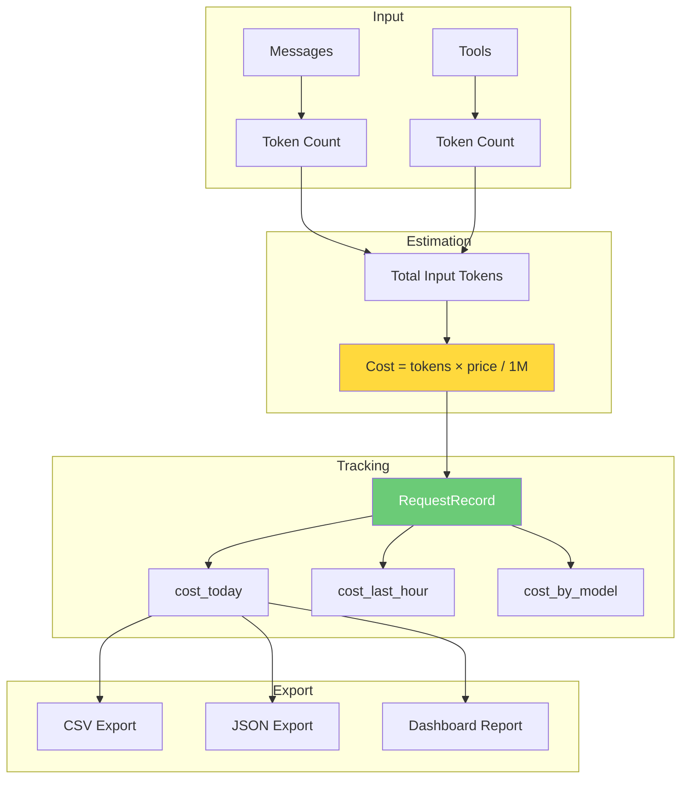
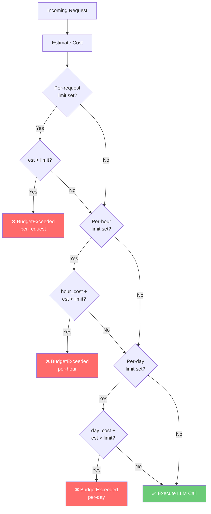
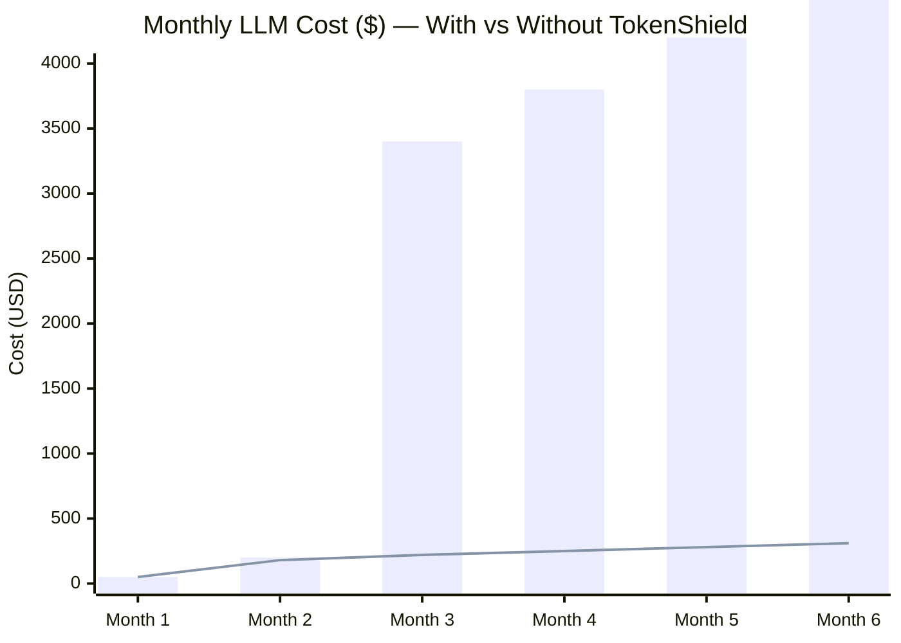

# TokenShield Architecture

## System Overview

## Request Lifecycle

## Cost Tracking Data Flow

## Budget Gate Decision Tree

## Cost Comparison: With vs Without TokenShield

| Metric | Without Shield | With Shield | Savings |
|--------|---------------|-------------|---------|
| Month 6 cost | $5,000 | $310 | **94%** |
| Runaway incidents | 3 | 0 | **100%** |
| Avg cost/request | $0.12 | $0.03 | **75%** |
| Budget overruns | 4 | 0 | **100%** |
